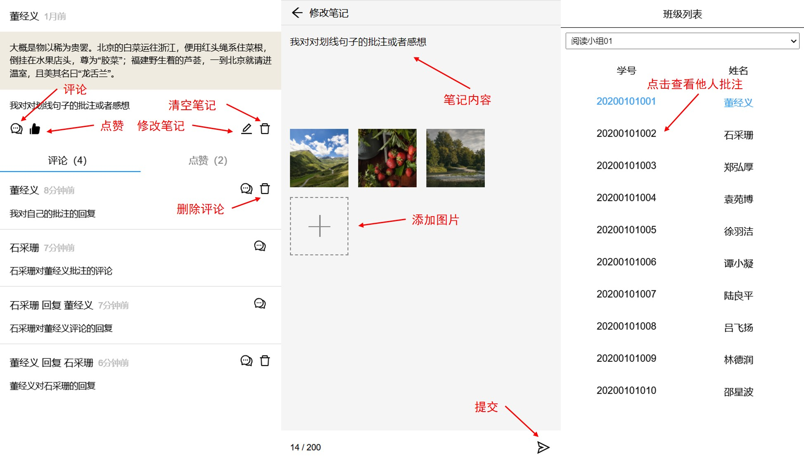
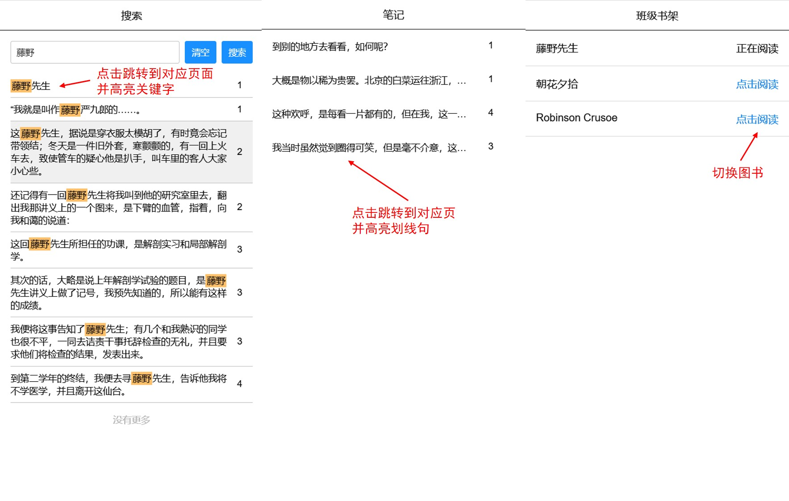
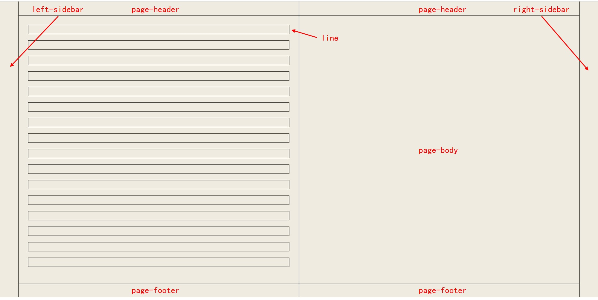

## 项目介绍

这个项目最初是一个实验室项目，由中小学校使用，为学生和老师提供在线课外阅读服务。用法是学生和老师可以对文字进行划线并添加批注，不同用户可以互相查看其他人的批注并且进行评论和回复，分享阅读感受。

整个项目包括在线阅读器，学生的作业模块，老师的班级、学生、作业等后台管理模块以及管理员的用户、组织等管理模块，其中在线阅读器是一个核心模块，功能较多，实现较复杂。整个项目最初使用 Bootstrap 和 Jquery 实现，在阅读器方面实现了分页显示，班级列表，划线和评论等功能，单页显示，左边是班级列表，右边是批注详情，界面比较简陋。

这个项目是使用 React 对阅读器的一个重构，只包含其前端部分，大幅提高了排版速度和性能，增加了动画、搜索、笔记列表、设置、双页显示、图片预览等新功能。

项目地址：[ 在线预览 ](https://tercoecouty.github.io/reader/)

## 项目截图

图书阅读界面：


笔记编辑，评论和查看他人批注等功能：




搜索，笔记列表和班级书籍：



页面结构：



## 功能实现

这个阅读器需要实现以下功能：

- 排版：对 TXT 文件进行分页并显示，文字两端对齐，支持中文和英文。对于中文，某些符号（如句号、逗号等）不可以出现在一行的开头，某些符号（如左括号、左书名号等）不可以出现在一行的结尾，以获得更好的阅读体验。当窗口尺寸改变时，可以自动重排。
- 翻页：支持左右翻页，支持使用鼠标滚轮和键盘翻页，可以跳转到任意一页，可以显示当前页以及总页数。
- 划线和批注：可以选择一段文字对其划线，称为一个批注，学生可以对该批注输入自己的感想，输入感想时支持添加至多九张图片，支持图片预览。
- 班级列表：可以显示当前学生所在的班级列表以及班级中的其他学生，当点击另一个学生时，可以查看该学生对这本书的批注。
- 评论和点赞：查看其他学生和自己的批注时，可以对该批注进行评论和点赞，可以回复其他人的评论，可以删除自己的评论，支持评论添加图片。
- 笔记列表：可以显示自己的所有批注，点击一个批注可以跳转到对应批注所在的页面。
- 图书列表：可以显示班级的图书，支持图书切换。
- 书签和书签列表：可以将某一页添加为书签，可以显示所有的书签，当点击一个书签时，可以跳转到该书签对应的页面。
- 搜索：可以搜索图书中的文字，当点击某一个搜索结果时，可以跳转到该结果对应的页面并高亮关键字。
- 设置：可以对行间距、缩进等进行设置。

### 分页

分页计算分为断行和分页两部分。断行时只考虑阅读区域的宽度和字符的宽度，将字符一个个加入行中，如果当前行的宽度超了过阅读区域宽度就进行断行，开始一个新行。进行断行计算时需要知道阅读区域的宽度以及每一个字符的宽度，实现的时候在 page-body 里面放置了一个隐藏的 span 来测量字符。

对于汉字，因为所有的汉字大小都是一样的，所以只需要预先测量一个汉字的宽度，之后可以对每一个汉字使用这个值，对于其他字符，特别是英文字符，不同的字母的宽度可能不一样，需要在遇到时测量并将值使用 Map 缓存。

在进行中文断行的时候，需要考虑“行首行尾禁则”，开始标点不出现在一行的末尾，结束标点不出现在一行的开头，在实现时会判断当前字符以及下一个字符是不是这些标点，如果是，把当前字符和下一个字符当作一个整体加入行中，如果行的长度超过了，那么整体放到下一行，否则放在这一行。

断行完成后，会根据阅读区域的高度对行进行分页，一个行的高度等于当前的字体大小加上设置的行间距。

### 显示

分页完成需要将内容显示在屏幕上，需要处理两个问题：

1. 显示划线时定位字符。
2. 文本对齐显示。

对于第一个问题，最开始的想法是将一行中的每一个字符用一个 span 来显式，每个字符设置一个 id。这个方案实现方便，可以直接定位字符，在显示中文的时候没有什么问题，但是在显示英文的时候会导致页面的 dom 数量过多，显著地拖慢了翻页的速度。第二种方案，是将一行的文字用一个 span 来显示，设置一个 first-char-id 属性，通过这个属性和 span 中字符的偏移量来间接定位字符的位置。如果这一行中有划线句子，那么把这一行分成多个 span，表示划线的句子和没有划线的句子，这种方案显著减少了 dom 的数量，在显示英文的时候也可以获得很好的性能。

对于第二个问题，尝试了几种不同的方法：

- text-align 不起作用，因为文字的宽度小于父元素的宽度。
- 使用 margin 或 padding 来对齐文字，但是问题是选择文字的时候会有间隔。
- 使用 flex 的 space-between，但是选择的文字之间的背景会有一小部分重叠，因此没有使用。
- 设置 letter-spacing 或者 word-spacing，可以对齐文本并且选择文本也不会有问题，一个问题是 word-spacing 对中文无效，而对英文设置 letter-spacing，在一般情况下看不出来和 word-spacing 的区别，但是如果这一行有长单词，那么字符之间的分隔会很明显。最后的解决办法是如果一行全部是英文，那么使用 word-spacing，否则使用 letter-spacing。
- text-align-last 属性，这个属性是用来对齐文本的最后一行，因此在一行文字的宽度小于父元素的宽度的时候可以使用它来对齐文本，是最佳解决方案，之前并没有注意过这个属性。

### 划线

添加划线的功能需要解决两个问题：

1. 用户选择文本的时候，定位字符的位置。
2. 对于划线的句子，需要在对应的字符下面显示下划线。

判断选择的文本使用到了 Range API，每次用户鼠标松开时，调用 document.getSelection().toString() 获取用户选择的文本，如果是空字符串，说明没有选择文本，只是鼠标点击。调用 document.getSelection().getRangeAt(0) 返回一个 range 对象，表示当前选择文本的范围，其中包括起始字符和结束字符所在的 Text 节点，以及字符在 Text 节点中的偏移量，Text 节点的父元素就是 span，通过 span 的 first-char-id 和字符的位置可以得到字符的 id，以此确定选择文字在书籍中的位置。

在添加划线之前还需要做一些检查，例如选择的文本里面是否有划线的句子，如果有那么和其他划线句重叠了，那么不允许划线。如果当前在查看别人的批注，也不可以划线，只有在自己阅读的时候才可以添加划线的句子。

一个划线句子的范围由 firstCharId 和 lastCharId 确定，在显示每一行的时候，会遍历每一个字符，检查当前字符是否在一个划线句的范围内，然后考虑几种不同的情况：

- 从普通句子进入划线句子
- 从划线句子进入普通句子
- 一个划线句子进入另一个划线句子
- 没有变化，仍然是普通句子或是相同的划线句子

然后把这一行分成几个 span，每个 span 都有一个 first-char-id 属性。

除了显示划线，还需要在文本中高亮显示搜索关键字，考虑到如果有交叉的话会非常麻烦，因此对于这样的行，行中的每一行都用一个 span 来显式，遍历行中的每一个字符，判断是否要显示下划线或者显示高亮效果。

## 性能优化

性能优化方面主要考虑减少不必要的刷新，Page 和 line 两个组件需要渲染大量的 dom，因此它们的重新渲染是要极力避免的。在项目的开发过程中遇到了这样一些性能问题：

- 选中文字会导致 Page 刷新

原因在于 Page 组件的父组件 Book 监听了鼠标抬起事件，如果用户选择了文本，会更新 Book 的 selection 状态，Book 刷新导致占据了页面的绝大部分的两个 Page 组件刷新，而 Page 并没有任何需要改变的地方。优化的方法是使用 useMemo：

```
const PageMemo = useMemo(() => <Page />, []);
```

- 更改书签会导致 Page 刷新

修改书签会导致 Page 刷新是因为书签是放在了 Page 组件里面的，状态改变了 Page 组件必然会刷新，因此需要做的是合理分割组件，使用 Bookmark 组件来实现书签功能，避免 Page 的不必要刷新。

- 点击划线会导致所有行刷新

Page 组件会监听鼠标点击事件，如果当前鼠标点击的地方有划线句子，会更新 currentNoteId 全局状态，每个 Line 组件都会获取这个状态，因此所有的行都会刷新，解决这个问题的关键是只有当前行有 currentNoteId 所表示的划线句子时，这个行才需要更新，因此需要使用 selectCurrentNoteIdByLine：

```react
export const selectCurrentNoteIdByLine = (state, line: ILine) => {
    const currentNoteId = state.book.currentNoteId;
    if (currentNoteId === null) return null;

    const notes = state.note.notes;
    const firstCharId = line.firstCharId;
    const lastCharId = line.firstCharId + line.text.length - 1;
    let notesByLine = notes.filter((note) => {
        if (note.lastCharId < firstCharId || note.firstCharId > lastCharId) return false;
        return true;
    });

    for (const note of notesByLine) {
        if (note.id === currentNoteId) {
            return currentNoteId;
        }
    }

    return null;
};
const currentNoteId = useSelector((state) => selectCurrentNoteIdByLine(state, line));
```

每次 currentNoteId 更新时，每个 useSelector 都会调用一次回调函数，因此 selectCurrentNoteIdByLine 会被调用很多次，但是总归比 Line 组件更新很多次要好一些。

- 添加划线会导致所有行刷新

这个问题同样时因为每个 Line 组件都会获取 notes 状态，当状态改变时全部都会刷新，解决办法还是确保只有需要改变的行刷新

```
const notes = JSON.parse(useSelector((state) => selectNotesByLine(state, line)));
```

selectNotesByLine 会将 note 数组用 JSON.stringify 将数组转换成字符串，让 useSelector 可以比较，使用时再转换为数组。

- dom 数量过多

这个问题就是之前提到的，如果每个字符都用一个 span 显示，英文文本的 dom 数量就太多了，因此让每一行使用一个 span，通过

1. range 对象中可以知道字符在 Text 节点中的偏移量

2. 如果一行中有划线，用多个 span 表示普通和划线句子

这两种方法，来实现相同的显示效果。

## 目录结构

这个项目的名字叫做 web-reader-2，是因为还有一个 web-reader。最开始整个项目是用 webpack 打包的，后来我发现 vite 能提供更好的开发体验，主要是 react 热加载开箱即用、默认支持多种静态资源处理、启动速度快而且依赖小，不需要下载一堆依赖项。因此整个项目从 webpack 改用了 vite，为了避免重构的麻烦另开了一个项目，叫做 web-reader-2。

下面是整个项目的目录结构：

```
.
├── images/
├── public/					# t
│   ├── text-demo.txt
│   ├── text-en.txt
│   └── text-zh.txt
├── src/
│   ├── api/
│   │   ├── data/			# 一些 json 文件，包含默认的测试数据
│   │   └── Api.ts
│   ├── app/
│   │   ├── Book/			# 图书排版和显示
│   │   │   ├── Book.less
│   │   │   ├── Book.tsx
│   │   │   ├── bookLayout.ts
│   │   │   ├── Bookmark.less
│   │   │   ├── Bookmark.tsx
│   │   │   ├── Line.less
│   │   │   ├── Line.tsx
│   │   │   ├── Page.less
│   │   │   └── Page.tsx
│   │   ├── Note/			# 笔记编辑，图片预览
│   │   │   ├── ImagePreview.less
│   │   │   ├── ImagePreview.tsx
│   │   │   ├── Note.less
│   │   │   ├── Note.tsx
│   │   │   ├── NoteEdit.less
│   │   │   ├── NoteEdit.tsx
│   │   │   ├── NoteImages.less
│   │   │   ├── NoteImages.tsx
│   │   │   ├── NoteUser.less
│   │   │   └── NoteUser.tsx
│   │   ├── Sidebar/		# 侧边栏
│   │   ├── App.less
│   │   ├── App.tsx			# 项目入口
# 左、右侧边栏的各项功能的实现
│   │   ├── Bookmarks.less
│   │   ├── Bookmarks.tsx	# 书签列表
│   │   ├── Bookshelf.less
│   │   ├── Bookshelf.tsx	# 班级书架
│   │   ├── Classes.less
│   │   ├── Classes.tsx		# 班级列表
│   │   ├── Notes.less
│   │   ├── Notes.tsx		# 笔记列表
│   │   ├── Search.less
│   │   ├── Search.tsx		# 搜索
│   │   ├── Settings.less
│   │   └── Settings.tsx	# 设置
│   ├── component/			# 公用的组件
│   │   ├── Drawer.less
│   │   ├── Drawer.tsx
│   │   ├── Icon.less
│   │   ├── Icon.tsx
│   │   ├── Select.less
│   │   ├── Select.tsx
│   │   ├── Switch.less
│   │   └── Switch.tsx
│   ├── slice/				# Redux Slice
│   │   ├── appSlice.ts
│   │   ├── bookmarkSlice.ts
│   │   ├── bookshelfSlice.ts
│   │   ├── bookSlice.ts
│   │   ├── classSlice.ts
│   │   ├── commentSlice.ts
│   │   ├── likeSlice.ts
│   │   └── noteSlice.ts
│   ├── svg/
│   ├── favicon.svg
│   ├── index.less
│   ├── index.tsx
│   ├── store.ts
│   └── vite-env.d.ts
├── index.html
├── package.json
├── README.md
├── tsconfig.json
├── vite.config.ts
└── yarn.lock
```

## React 总结

TODO
